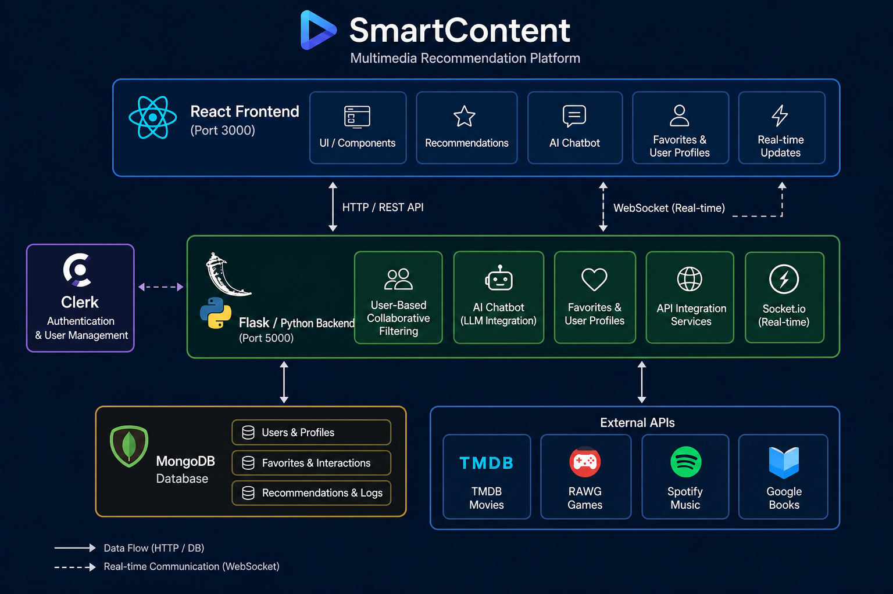
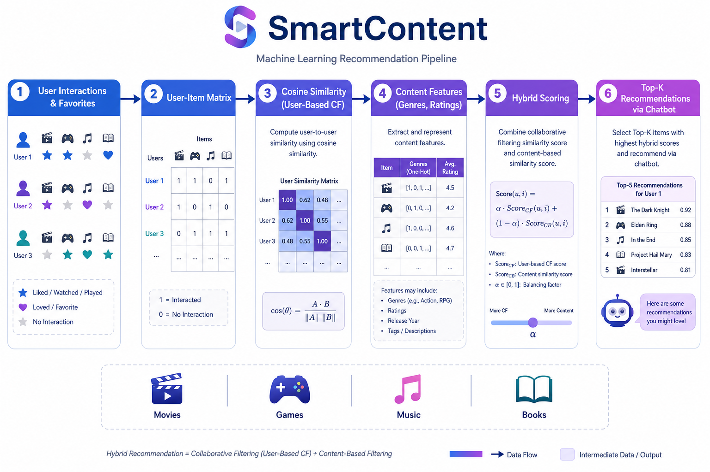

# SmartContent


**SmartContent** is a high-performance multimedia recommendation platform that combines a **User-Based Collaborative Filtering (UBCF)** engine with an **AI-driven chatbot** to deliver personalized suggestions across **movies**, **video games**, **music**, and **books**. The application follows a Spotify-inspired interface and is designed to scale with large multimedia catalogs through a decoupled frontend/backend architecture.

> **Repository note:** This checkout includes the **React frontend** and backend **dependency templates** (`backend/requirements.txt`, `backend/setup.py`). The Python API server that powers recommendations is expected to run separately on port `5000`. See [Reproduction Guide](#reproduction-guide) for the full setup.

---

## Table of Contents

- [Demo](#demo)
- [Context & Motivation](#context--motivation)
- [System Architecture](#system-architecture)
- [Techniques & Methods](#techniques--methods)
- [Models & Algorithms](#models--algorithms)
- [Evaluation Metrics](#evaluation-metrics)
- [Features](#features)
- [Tech Stack](#tech-stack)
- [Project Structure](#project-structure)
- [Reproduction Guide](#reproduction-guide)
- [API Reference](#api-reference)
- [Environment Variables](#environment-variables)
- [Known Limitations](#known-limitations)

---

## Demo

Watch the full project walkthrough:

**[SmartContent Demo Video (Google Drive)](https://drive.google.com/file/d/1WUqSPYJgncweazpMyHti2bX5kpmdatbi/view?usp=drive_link)**

### UI Preview


---

## Context & Motivation

Modern streaming and content platforms manage **massive heterogeneous catalogs** spanning multiple media types. Users struggle to discover relevant content when catalogs grow beyond manual browsing. SmartContent addresses this by:

1. **Centralizing** movies, games, music, and books in a single unified interface.
2. **Learning user preferences** from explicit interactions (favorites, likes, playlists).
3. **Combining collaborative filtering** with **conversational AI bots** so users can express preferences in natural language (genres, platforms, moods, artist names).
4. **Integrating external APIs** (TMDB, RAWG, Spotify, Google Books) to enrich catalogs without storing entire datasets locally.

The system targets a **big-data-friendly architecture**: paginated catalog endpoints, MongoDB for user profiles and interactions, and a recommendation layer that can be extended with batch preprocessing or distributed compute for larger user-item matrices.

---

## System Architecture



| Layer | Component | Role |
|-------|-----------|------|
| **Presentation** | React + Vite (port `3000`) | Spotify-like UI, chatbot, audio player, admin dashboard |
| **Authentication** | Clerk | OAuth (Google), JWT session, user sync to MongoDB |
| **Real-time** | Socket.io | Online users, chat messages, playback activity |
| **Application** | Flask API (port `5000`) | REST endpoints, recommendation engine, favorites CRUD |
| **Persistence** | MongoDB | Users, songs/albums, favorites, interaction history |
| **External data** | TMDB, RAWG, Spotify, Google Books | Catalog enrichment and metadata |

---

## Techniques & Methods

### 1. User-Based Collaborative Filtering (UBCF)

The core recommendation engine builds a **user–item interaction matrix** from:

- Favorite movies, games, music tracks, and books
- Implicit signals (play counts, likes, playlist additions)

For a target user `u`, the system:

1. Finds **k nearest neighbors** among other users using **cosine similarity** on their rating/interaction vectors.
2. Aggregates neighbor preferences for items `u` has not yet interacted with.
3. Returns **Top-K** ranked recommendations per domain.

### 2. Content-Based Filtering (Hybrid Support)

When collaborative data is sparse (cold-start users), the backend falls back to **content features**:

| Domain | Features used |
|--------|---------------|
| **Movies** | Genres, language, TMDB vote average, overview keywords |
| **Games** | Genre, platform, RAWG rating |
| **Music** | Artist, genre tags, playcount, listeners |
| **Books** | Authors, genre, language, publication metadata |

Game recommendations additionally support a **structured wizard**: genre selection → platform selection → filtered API query.

### 3. AI-Driven Chatbot Interface

Four specialized bots guide users through preference collection:

| Bot | Interaction mode | Backend endpoint |
|-----|------------------|------------------|
| **Games Bot** | Multi-step (genre → platform) or title search | `POST /recommend`, `POST /recommend_title` |
| **Movies Bot** | Free-text query (genre, mood, description) | `POST /recommend_movie` |
| **Music Bot** | Free-text query (artist, genre) | `POST /recommend_music` |
| **Books Bot** | Free-text query (topic, genre) | `POST /recommend_book` |

Recommendations appear both in the chat thread and in the **right sidebar** (`FriendsActivity` panel).

### 4. Real-Time Social Layer

Socket.io events propagate:

- User online/offline status
- Chat messages between users
- Currently playing track activity (`update_activity`)

### 5. Catalog Management

- **Paginated browsing** (7 items per page) for each media type
- **Admin CRUD** for locally hosted songs and albums (multipart upload)
- **Favorites** synced per authenticated user

---

## Models & Algorithms



| Component | Algorithm / Library | Description |
|-----------|---------------------|-------------|
| **User similarity** | Cosine similarity (`scikit-learn`) | Compares user interaction vectors in sparse matrix |
| **Neighbor selection** | k-NN (k ≈ 10–50, configurable) | Top similar users for score aggregation |
| **Score aggregation** | Weighted average of neighbor ratings | Predicts preference for unseen items |
| **Content similarity** | TF-IDF + cosine (text queries) | Maps natural-language chat input to catalog items |
| **Matrix operations** | `NumPy`, `SciPy`, `Pandas` | Efficient sparse matrix handling for large catalogs |
| **External ranking** | API-native scores (TMDB vote, RAWG rating, Spotify playcount) | Re-ranks candidates from third-party sources |

### Hybrid scoring (when both signals are available)

```
final_score = α × collaborative_score + (1 − α) × content_score
```

Typical starting value: **α = 0.6** (collaborative-dominant), tunable per domain.

---

## Evaluation Metrics

The recommendation engine should be evaluated with standard information-retrieval and rating-prediction metrics:

| Metric | Purpose | Target direction |
|--------|---------|------------------|
| **Precision@K** | Relevance of top-K recommendations | ↑ Higher |
| **Recall@K** | Coverage of relevant items in top-K | ↑ Higher |
| **F1-Score** | Balance of precision and recall | ↑ Higher |
| **MAE** | Mean absolute error on predicted ratings | ↓ Lower |
| **RMSE** | Root mean squared error on ratings | ↓ Lower |
| **Coverage** | Fraction of catalog items ever recommended | ↑ Higher (avoid filter bubbles) |
| **Diversity** | Intra-list genre/topic spread | ↑ Higher |
| **Hit Rate@K** | Users with ≥1 relevant item in top-K | ↑ Higher |

### Evaluation protocol

1. Split user interactions into **train / validation / test** (e.g., 70/15/15).
2. Train UBCF on the training set; tune `k` and `α` on validation.
3. Report Precision@5, Recall@10, MAE, and RMSE on the held-out test set.
4. Run **cold-start** and **warm-user** scenarios separately.

---

## Features

- **Unified multimedia hub** — Browse movies, games, music, and books from one dashboard
- **Personalized recommendations** — User-Based CF powered by favorites and interactions
- **Conversational discovery** — Four AI bots for domain-specific preference elicitation
- **Favorites & playlists** — Save and manage preferred content across all media types
- **Audio playback** — Built-in player with queue management
- **Real-time activity** — See what friends are listening to via Socket.io
- **Admin panel** — Upload and manage local songs/albums (requires backend + routing)
- **OAuth authentication** — Secure sign-in via Clerk (Google)

---

## Tech Stack

### Frontend (included in this repo)

| Technology | Version | Usage |
|------------|---------|-------|
| React | 18.3 | UI framework |
| TypeScript | 5.6 | Type safety |
| Vite | 5.4 | Dev server & build (port `3000`) |
| Zustand | 5.0 | State management |
| Tailwind CSS | 3.4 | Styling |
| shadcn/ui (Radix) | — | UI components |
| Clerk | 5.14 | Authentication |
| Socket.io Client | 4.8 | Real-time events |
| Axios | 1.7 | HTTP client |
| React Router | 6.27 | Routing |

### Backend (expected — not included as source)

| Technology | Usage |
|------------|-------|
| Python 3.10+ | API server |
| Flask + Flask-CORS + Flask-SocketIO | REST & WebSocket |
| MongoDB + PyMongo | Database |
| scikit-learn, NumPy, Pandas, SciPy | Recommendation engine |
| TMDB / RAWG / Spotify / Google Books APIs | External catalogs |

---

## Project Structure

```
SmartContent/
├── README.md
├── docs/
│   └── images/
│       ├── architecture.png
│       ├── recommendation-pipeline.png
│       └── ui-mockup.png
├── backend/                          # Dependency templates (API source separate)
│   ├── requirements.txt
│   ├── setup.py
│   └── .env.example
└── frontend/
    ├── package.json
    ├── .env.example
    ├── vite.config.ts
    └── src/
        ├── App.tsx                   # Route definitions
        ├── types/index.ts            # Domain models (User, Game, Movie, Music, Book)
        ├── lib/axios.ts              # API client (base: localhost:5000/api)
        ├── providers/AuthProvider.tsx
        ├── stores/
        │   ├── useChatStore.ts       # Chatbot logic + recommendation calls
        │   ├── useMusicStore.ts      # Catalog, favorites, pagination
        │   ├── usePlayerStore.ts     # Audio queue + activity socket
        │   └── useAuthStore.ts       # Admin role check
        ├── layout/                   # Spotify-like 3-panel layout
        └── pages/
            ├── home/                 # Featured content
            ├── chat/                 # Bot conversations
            ├── dashboard/            # Catalog browser
            └── album/                # Playlist view
```

---

## Reproduction Guide

### Prerequisites

| Tool | Version | Purpose |
|------|---------|---------|
| **Node.js** | 18+ | Frontend dev server |
| **Python** | 3.10+ | Backend API |
| **MongoDB** | 6+ | User & catalog persistence |
| **Clerk account** | — | Authentication ([clerk.com](https://clerk.com)) |
| **API keys** | — | TMDB, RAWG, Spotify, Google Books |

---

### 1. Clone the repository

```bash
git clone https://github.com/<your-username>/SmartContent.git
cd SmartContent
```

---

### 2. Backend setup (Python)

```bash
cd backend

# Create and activate a virtual environment
python -m venv venv

# Windows
venv\Scripts\activate

# macOS / Linux
source venv/bin/activate

# Install dependencies
pip install -r requirements.txt

# Or install as an editable package
pip install -e .
```

Copy and configure environment variables:

```bash
cp .env.example .env
# Edit .env with your MongoDB URI, Clerk secret, and API keys
```

Start the API server (once the Flask application source is available):

```bash
# Expected entry point after backend source is added
python app.py
# Server listens on http://localhost:5000
```

---

### 3. Frontend setup (React)

```bash
cd frontend

# Install dependencies
npm install

# Configure Clerk
cp .env.example .env
# Set VITE_CLERK_PUBLISHABLE_KEY=pk_test_...

# Start development server
npm run dev
# App available at http://localhost:3000
```

---

### 4. MongoDB setup

```bash
# Start MongoDB locally (example with Docker)
docker run -d --name smartcontent-mongo -p 27017:27017 mongo:6

# Connection string (set in backend/.env)
MONGODB_URI=mongodb://localhost:27017/smartcontent
```

---

### 5. Clerk configuration

1. Create a Clerk application at [dashboard.clerk.com](https://dashboard.clerk.com).
2. Enable **Google OAuth** as a sign-in provider.
3. Copy the **Publishable Key** → `frontend/.env` as `VITE_CLERK_PUBLISHABLE_KEY`.
4. Copy the **Secret Key** → `backend/.env` as `CLERK_SECRET_KEY`.
5. Set redirect URLs: `/sso-callback`, `/auth-callback`.

---

### 6. External API keys

| Service | Sign up | Used for |
|---------|---------|----------|
| [TMDB](https://www.themoviedb.org/settings/api) | Free API key | Movie metadata & posters |
| [RAWG](https://rawg.io/apidocs) | Free tier | Game catalog & filters |
| [Spotify Developer](https://developer.spotify.com/dashboard) | OAuth app | Music search & metadata |
| [Google Books](https://developers.google.com/books) | API key | Book search & covers |

---

### 7. Production build

```bash
# Frontend
cd frontend
npm run build
npm run preview   # Preview production build

# Backend (with gunicorn)
cd backend
gunicorn -w 4 -b 0.0.0.0:5000 app:app
```

---

## API Reference

### REST — Authenticated routes (`/api/*`)

| Method | Endpoint | Description |
|--------|----------|-------------|
| `POST` | `/api/auth/callback` | Sync Clerk user to MongoDB |
| `GET` | `/api/admin/check` | Verify admin role |
| `GET` | `/api/stats` | Dashboard statistics |
| `GET` | `/api/albums` | List albums |
| `GET` | `/api/albums/:id` | Album details |
| `GET` | `/api/songs/made-for-you` | Personalized songs |
| `GET` | `/api/songs/trending` | Trending songs |
| `POST` | `/api/admin/songs` | Upload song (multipart) |
| `POST` | `/api/admin/albums` | Upload album (multipart) |
| `DELETE` | `/api/admin/songs/:id` | Delete song |
| `DELETE` | `/api/admin/albums/:id` | Delete album |
| `GET` | `/api/users/messages/:userId` | Fetch chat history |

### REST — Catalog & favorites (port `5000`)

| Method | Endpoint | Description |
|--------|----------|-------------|
| `GET` | `/music?page_songs=&per_page_songs=7` | Paginated music catalog |
| `GET` | `/movie?page_movies=&per_page_movies=7` | Paginated movies |
| `GET` | `/game?page_games=&per_page_games=7` | Paginated games |
| `GET` | `/book?page_books=&per_page_books=7` | Paginated books |
| `GET` | `/favorites_movies` | User's favorite movies |
| `GET` | `/favorites_musics` | User's favorite music |
| `GET` | `/favorites_games` | User's favorite games |
| `GET` | `/favorites_books` | User's favorite books |
| `POST` | `/add_favorite_movies` | Add movie favorite |
| `POST` | `/remove_favorite_movies` | Remove movie favorite |
| `POST` | `/add_favorite_games` | Add game favorite |
| `POST` | `/remove_favorite_games` | Remove game favorite |
| `POST` | `/add_favorite_musics` | Add music favorite |
| `POST` | `/add_favorite_musics_spotify` | Add Spotify track with metadata |
| `POST` | `/remove_favorite_musics` | Remove music favorite |
| `POST` | `/add_favorite_books` | Add book favorite |
| `POST` | `/add_favorite_books_google` | Add Google Books entry |
| `POST` | `/remove_favorite_books` | Remove book favorite |

### Recommendation endpoints

| Method | Endpoint | Body | Description |
|--------|----------|------|-------------|
| `POST` | `/recommend` | `{ genre, platform }` | Game recommendations by filters |
| `POST` | `/recommend_title` | `{ title }` | Game recommendations by title similarity |
| `POST` | `/recommend_movie` | `{ query }` | Movie recommendations from text |
| `POST` | `/recommend_music` | `{ query_music }` | Music recommendations from text |
| `POST` | `/recommend_book` | `{ query_book }` | Book recommendations from text |

### Socket.io events

| Direction | Event | Payload |
|-----------|-------|---------|
| Client → Server | `user_connected` | `userId` |
| Client → Server | `update_activity` | `{ userId, activity }` |
| Server → Client | `users_online` | `string[]` |
| Server → Client | `receive_message` | `Message` |
| Server → Client | `message_sent` | `Message` |

---

## Environment Variables

### Frontend (`frontend/.env`)

```env
VITE_CLERK_PUBLISHABLE_KEY=pk_test_...
```

### Backend (`backend/.env`)

```env
MONGODB_URI=mongodb://localhost:27017/smartcontent
CLERK_SECRET_KEY=sk_test_...
TMDB_API_KEY=...
RAWG_API_KEY=...
SPOTIFY_CLIENT_ID=...
SPOTIFY_CLIENT_SECRET=...
GOOGLE_BOOKS_API_KEY=...
PORT=5000
FLASK_ENV=development
```

---

## Known Limitations

| Item | Status |
|------|--------|
| Backend Python source (`app.py`) | Not included in this checkout — dependency templates provided |
| Static assets (`/bots/`, `/cover-*/`, `/songs/`) | Referenced in code but not bundled |
| Routes `/auth-callback`, `/admin` | Pages exist but are not wired in `App.tsx` |
| Hardcoded `localhost:5000` | Used in several `fetch` calls; configure proxy for production |

---

## License

This project is provided for educational and portfolio purposes. Check individual API terms of service (TMDB, RAWG, Spotify, Google Books) before deploying publicly.

---

## Contributing

1. Fork the repository
2. Create a feature branch (`git checkout -b feature/my-feature`)
3. Commit your changes (`git commit -m 'Add my feature'`)
4. Push to the branch (`git push origin feature/my-feature`)
5. Open a Pull Request
